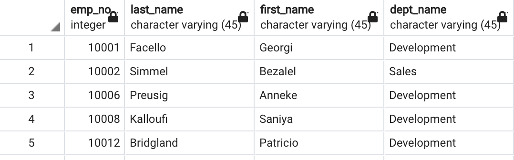

# SQL Challenge

In this challenge we used PgAdmin to work with PostgresSQL to analyze the database of past employees from the 1980s and 1990s. This database includes different cvs spreadsheets that were imported and then queried using PostgresSQL.   

Before creating the schema, we used the diagrams program offered by quickdatabasediagrams.com to help with the visualization of the primary and foreign keys.

After creating the tables, the file is then exported to help build our schema. The schema is then brought into PgAdmin to build our tables to then import the csv files. Once everything is well organized, we then moved on to query the data. 

Below is a sample snapshot of a table showing employees in the Sales and Development departments which includes their employer number, last name, first name, and department name. 

Overall, it was great working with PostgresSQL. The process was very straight forward, and the syntax was easy to understand and follow.
